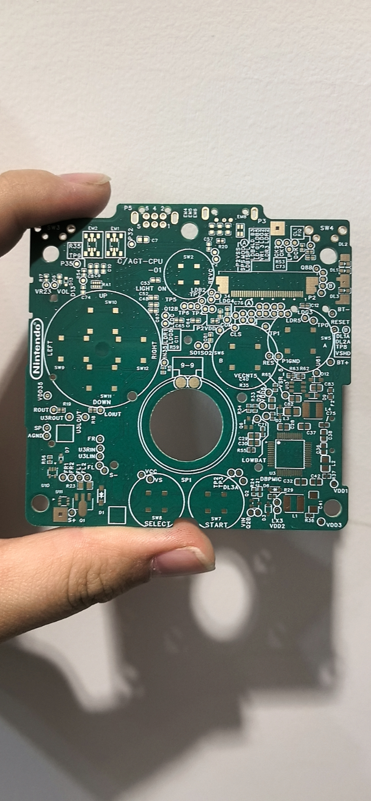
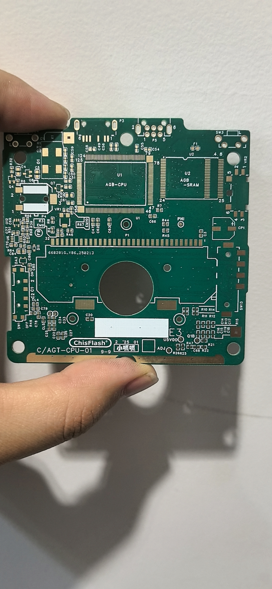
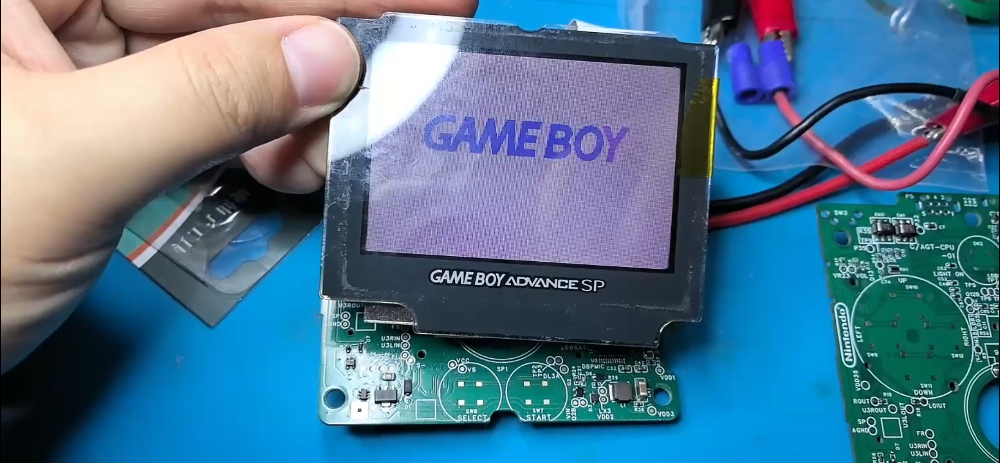

【硬核少年のGBASP复刻日记】当00后开始玩考古是种什么体验？🎮✨

（前情提要：全网找不到GBASP原理图の暴风哭泣→2025新年flag：这冷门机子我来盘！）

STEP 1 寻宝计划🔍
在技术宅群跪求"尸体机"，意外解锁宝藏队友@李蕴木（给大佬递茶！）收到古董板子的瞬间——这包浆，这焊痕，妥妥电子文物既视感！

STEP 2 机械降神模式⚡
暴力拆解+电子元件大体检（电桥：当代赛博听诊器实锤）最绝的是打印机魔改扫描仪！当4K高清电路图加载完毕那刻，本强迫症DNA动了~

STEP 3 铜层の美妆时间💅
砂纸打磨出隐藏铜层×激光扫描仪→别人玩刮刮乐，我玩刮电路板！看到多层PCB像千层蛋糕般展开，瞳孔地震.jpg

STEP 4 赛博女娲捏土记💻
爆肝EDA两周达成：原理图全解谜+1:1像素级复刻！当第一版板子翻车时——音量键：已下线；当第二版背光扑街时——本锦鲤当场作法：玄学改版+替代阻容大法，叮~您的童年开机音效已加载完毕！

（后记：现开放开源文档&定制改装服务，想一起搞机的朋友看过来~）#复古游戏机 #硬核玩家 #Z世代硬核浪漫

附上图片：

